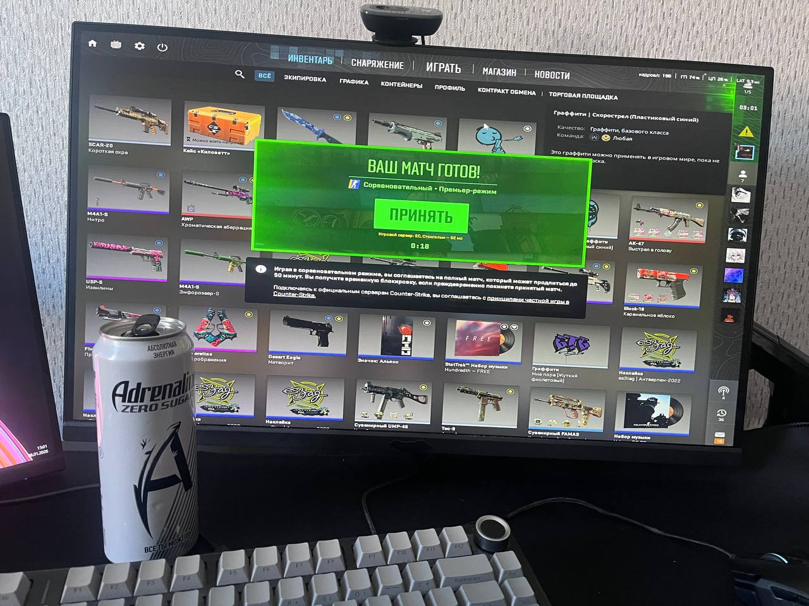

# GoodTaskTracker

[](https://github.com/TeamKOMAP/BadTaskTracker/actions)

Веб-приложение для управления задачами с поддержкой рабочих пространств, ролей, отчетности и email-аутентификации.

## Возможности

- **Рабочие пространства (Workspaces)** — изолированные области для команд и проектов
- **Управление задачами** — создание, редактирование, удаление, фильтрация по статусу, исполнителю, тегам, срокам
- **Система ролей** — Owner (владелец), Admin (админ), Member (участник)
- **Теги** — цветные метки для категоризации задач
- **Вложения** — загрузка файлов к задачам (до 50MB)
- **Отчетность** — сводка по статусам, просроченные задачи, среднее время выполнения
- **Приглашения** — приглашение новых участников по email
- **Email-аутентификация** — вход по коду из email (JWT)
- **Уведомления** — напоминания о дедлайнах, приглашениях, изменениях
- **Swagger UI** — интерактивная документация API

## Архитектура

Проект построен на принципах **Clean Architecture** (DDD-lite):

```
TaskManager/
├── TaskManager.Domain/          # Доменный слой: сущности, перечисления, интерфейсы репозиториев
├── TaskManager.Application/     # Прикладной слой: сервисы, DTO, бизнес-логика
├── TaskManager.Infrastructure/  # Инфраструктура: репозитории, БД, email, хранилище файлов
├── TaskManager.API/            # Presentation: контроллеры, SPA frontend, безопасность
├── TaskManager.Tests/          # Unit-тесты
└── TaskManager.sln
```

### Слои приложения

- **Domain** — Сущности (Task, User, Workspace, Tag, Notification), перечисления (TaskItemStatus, WorkspaceRole), доменные исключения
- **Application** — Сервисы (TaskService, WorkspaceService, AuthService), DTO, интерфейсы репозиториев
- **Infrastructure** — Реализации репозиториев, EF Core DbContext, миграции, Email-сервис, FileStorage
- **API** — REST контроллеры, JWT-аутентификация, Background Services, SPA (HTML/CSS/JS)

### Стек технологий

- **.NET 8.0** — Backend framework
- **ASP.NET Core Web API** — REST API
- **Entity Framework Core** — ORM (SQLite по умолчанию)
- **JWT** — Аутентификация и авторизация
- **HTML/CSS/JS** — Frontend (без фреймворков, нативный JS)
- **RateLimiting** — Ограничение частоты запросов

## Быстрый старт

### Требования

- .NET 8.0 SDK
- Любой браузер

### Запуск (1 команда)

```bash
dotnet run --project TaskManager.API
```

Приложение будет доступно:
- **Frontend**: http://localhost:5202
- **Swagger UI**: http://localhost:5202/swagger

При первом запуске автоматически:
- Создаётся база данных SQLite (`TaskManager.db`)
- Применяются миграции

### Настройка email (опционально)

Для работы email-аутентификации скопируйте `.env.example` в `.env` и заполните настройки HTTP API-провайдера (Resend-совместимого):

```env
Email__Provider=HttpApi
Email__HttpApi__Provider=Resend
Email__HttpApi__BaseUrl=https://api.resend.com
Email__HttpApi__SendPath=/emails
Email__HttpApi__ApiKey=your-http-email-api-key
Email__HttpApi__FromEmail=your-verified-sender@example.com
Email__HttpApi__FromName=BadTaskTracker
```

SMTP остается доступным как fallback, но для Render рекомендуется HTTP API.

### Настройка хранилища (Local / MinIO / S3)

```env
Storage__Provider=Local
Storage__PublicBucket=gtt-public
Storage__PrivateBucket=gtt-private
Storage__Endpoint=
Storage__Region=us-east-1
Storage__AccessKey=
Storage__SecretKey=
Storage__ForcePathStyle=true
Storage__LocalRootPath=App_Data/object-storage
```

## Deploy на Render (Scenario 1)

В проект уже добавлены артефакты для быстрого production-деплоя с текущей архитектурой:

- `render.yaml` — Blueprint с двумя сервисами (API + private MinIO)
- `TaskManager.API/Dockerfile` — контейнеризация API
- `.dockerignore` — исключения для сборки образа
- `GET /healthz` — endpoint для health check

Подробный пошаговый продакшен-план и чек-листы находятся в `docs/render-scenario1-production.md`.

## API Endpoints

### Аутентификация

| Метод | Путь | Описание |
|-------|------|----------|
| POST | `/api/auth/email/request` | Запросить код на email |
| POST | `/api/auth/email/verify` | Подтвердить код, получить токен |
| GET | `/api/auth/me` | Получить данные текущего пользователя |
| POST | `/api/auth/switch-workspace` | Переключиться между рабочими пространствами |
| POST | `/api/auth/timezone` | Обновить часовой пояс |
| POST | `/api/auth/nickname` | Изменить никнейм |

### Рабочие пространства

| Метод | Путь | Описание |
|-------|------|----------|
| GET | `/api/spaces` | Список рабочих пространств пользователя |
| GET | `/api/spaces/{id}` | Получить рабочее пространство |
| POST | `/api/spaces` | Создать рабочее пространство |
| PUT | `/api/spaces/{id}` | Обновить рабочее пространство |
| POST | `/api/spaces/{id}/avatar` | Загрузить аватар |
| DELETE | `/api/spaces/{id}/avatar` | Удалить аватар |
| GET | `/api/spaces/{id}/members` | Список участников |
| POST | `/api/spaces/{id}/members` | Добавить участника |
| DELETE | `/api/spaces/{id}/members/{userId}` | Удалить участника |
| POST | `/api/spaces/{id}/invites` | Создать приглашение |

### Задачи

| Метод | Путь | Описание |
|-------|------|----------|
| GET | `/api/tasks` | Список задач с фильтрацией |
| GET | `/api/tasks/{id}` | Получить задачу |
| POST | `/api/tasks` | Создать задачу |
| PUT | `/api/tasks/{id}` | Обновить задачу |
| DELETE | `/api/tasks/{id}` | Удалить задачу |

**Параметры фильтрации:**
- `status` — статус задачи (New, InProgress, Completed, Cancelled)
- `assigneeId` — ID исполнителя
- `dueBefore` / `dueAfter` — фильтр по сроку
- `tagIds` — ID тегов

### Теги

| Метод | Путь | Описание |
|-------|------|----------|
| GET | `/api/tags` | Список тегов (с поиском по `?q=`) |
| GET | `/api/tags/{id}` | Получить тег |
| POST | `/api/tags` | Создать тег (или получить существующий по названию) |

### Вложения

| Метод | Путь | Описание |
|-------|------|----------|
| GET | `/api/tasks/{taskId}/attachments` | Список вложений |
| GET | `/api/tasks/{taskId}/attachments/exists` | Проверка наличия вложений |
| POST | `/api/tasks/{taskId}/attachments` | Загрузить вложения (multipart/form-data, до 50MB) |
| POST | `/api/tasks/attachments/counts` | Количество вложений для нескольких задач |
| GET | `/api/tasks/{taskId}/attachments/{id}` | Скачать вложение |
| DELETE | `/api/tasks/{taskId}/attachments/{id}` | Удалить вложение |

### Отчеты

| Метод | Путь | Описание |
|-------|------|----------|
| GET | `/api/reports/status-summary` | Сводка по статусам |
| GET | `/api/reports/overdue-by-assignee` | Просроченные задачи по исполнителям |
| GET | `/api/reports/avg-completion-time` | Среднее время выполнения |

### Уведомления

| Метод | Путь | Описание |
|-------|------|----------|
| GET | `/api/notifications` | Список уведомлений (`?unreadOnly=true`, `?take=50`) |
| GET | `/api/notifications/unread-count` | Количество непрочитанных |
| POST | `/api/notifications/{id}/read` | Отметить как прочитанное |
| POST | `/api/notifications/read-all` | Прочитать все |

### Приглашения

| Метод | Путь | Описание |
|-------|------|----------|
| GET | `/api/invites/me` | Мои приглашения (`?status=Pending`) |
| POST | `/api/invites/{id}/accept` | Принять приглашение |
| POST | `/api/invites/{id}/decline` | Отклонить приглашение |

## Аутентификация в API

API использует JWT токены. Заголовки для запросов:

```
X-Actor-UserId: 1          # ID пользователя
X-Workspace-Id: 1          # ID рабочего пространства (для запросов к /api/tasks, /api/tags и т.д.)
Authorization: Bearer {token}
```

## Скриншоты UI

Интерфейс представляет собой SPA на чистом HTML/CSS/JS:

### Экраны приложения

- **Главная (index.html)** — выбор рабочего пространства, вход по email
- **Доска задач (workspace.html)** — Kanban-доска, список, календарь, диаграмма связей
- **Отчёты (reports.html)** — статистика и графики
- **Приглашения (invites.html)** — управление приглашениями

### Внешний вид




## Запуск тестов

```bash
dotnet test
```

## Known Issues

### Безопасность и производительность

1. **Rate Limiting** — API использует rate limiting для эндпоинтов email-аутентификации (3 запроса в минуту на IP). При превышении лимита возвращается ошибка 429.

2. **CORS** — CORS-политика в проекте не включена по умолчанию. Для multi-origin frontend в продакшене требуется явная настройка.

3. **SQLite** — Для high-load production рекомендуется переход на PostgreSQL. SQLite не поддерживает параллельные записи и не подходит для высоконагруженных систем.

4. **JWT Token** — Токены хранятся на клиенте в localStorage. В production рекомендуется использовать httpOnly cookies для защиты от XSS.

### Хранение данных

5. **Файловое хранилище** — Аватары и вложения работают через object storage (`Storage:Provider`: Local/S3). Для production рекомендуется S3-совместимое хранилище.

6. **Очистка object storage** — При удалении workspace нужно дополнительно учитывать очистку связанных object keys.

### Email и уведомления

7. **Email transport** — Для Render рекомендуется HTTP API (Resend-совместимый). В development режиме можно включить fallback-код (`EmailAuth:EnableDevelopmentCodeFallback`).

8. **Email rate limiting** — Ограничение на отправку писем: не более 10 писем в минуту для предотвращения спама.

9. **Background jobs** — Уведомления о дедлайнах обрабатываются фоновым сервисом. Интервал проверки настраивается в конфигурации.

### Функциональные ограничения

10. **Timezone** — Даты хранятся в UTC, пользователь видит их в своём часовом поясе (настраивается в профиле). При смене часового пояса исторические данные не пересчитываются.

11. **Nickname cooldown** — Изменение nickname ограничено: нельзя менять чаще чем раз в 72 часа.

12. **Workspace isolation** — Участник workspace может видеть только задачи и данные своего workspace. Нет возможности межworkspace взаимодействия.

13. **Attachment limits** — Максимальный размер файла: 50MB. Типы файлов не валидируются (проверяется только размер).

14. **Invite expiration** — Приглашения в workspace истекают через 7 дней. Просроченные приглашения требуют повторной отправки.

## Ретроспектива

### Что получилось хорошо?
@Bogdasaren
Реализация отчетов;
Реализация профилей;
Сортировка, поиск, фильтрация задач;

@prowogn
Web-hook бот телеграм;
Авто-тесты;
CI реализация;

@Makway
Архитектура API, DB;
Сортировка, поиск, фильтрация задач;
Соло-бэкэнд (типо ветеран сво);
JWT;

@offlayt
Режимы отображения задач;
Разделения на рабочие пространства;
Возможность работать в команде внутри рабочего пространства;
Передача данных Моссаду;

### Что можно добавить, улучшить?
@Bogdasaren
Казино;

@prowogn
QA организация;
Увеличить покрытие тестами;
Расширить CI;

@Makway
[JEW] Подключить платные подписки. 
Интеграция с другими внешними сервисами. 
Сделать этот сервис микросервисом 
Для какой нибудь компании можно внедрить в корпоративную архитектуру для продуктивности.

@offlayt
Мессенджер и чаты внутри рабочего пространства, стикеры.

### Lessons learned
@Bogdasaren
Границы структуры проекта должны быть оговорены на старте, до разработки.

@prowogn
Вся организация в целом: GitHub branches, Agile (стендапы, более частое прибегание в DoD и прочие организационные моменты), постоянное напоминание требований из ТЗ для обеспечения качества (QA) проекта.

@Makway
Java + React + postgres + redis + spring 3.8.5 лучше.

@offlayt
Начинать разработку проекта нужно с этапа проработки ТЗ, т.е. неясное ТЗ = проблемы в разработке.

